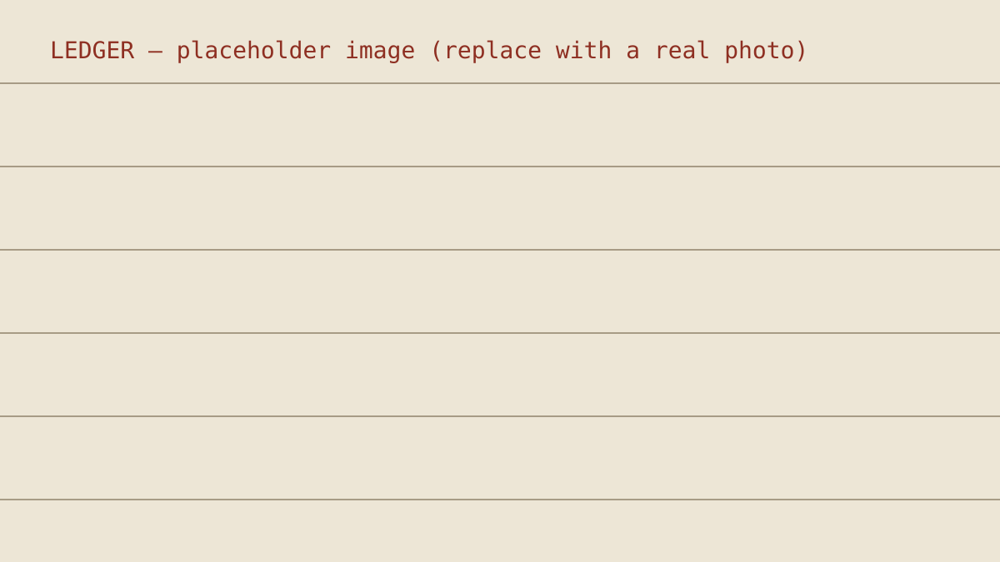

# On the Record — portfolio, commentary & fiction for a Human Rights Officer

Archival "legal dossier" design: statute-numbered sections, an experience
docket, citation-styled publications, a hover-to-unredact motif, marginalia,
paper/night themes — plus a markdown-powered blog ("Commentary") and a
fiction & poetry section ("The Other Ink") with an Instagram dispatches block.

## Pages
- index.html — hero (CV download), brief, practice, docket, publications, podium, writing teaser, contact
- blog.html — commentary listing (filter chips, featured "Exhibit A")
- fiction.html — stories & poems listing + Instagram placeholder tiles
- read.html — renders ANY post from markdown (?slug=...)
- admin/ — optional browser CMS (see "Publishing option C")

## ✍️ Publishing WITHOUT touching HTML

All writing lives in `content/` as plain Markdown:

    content/
      blog/       ← commentary posts (.md)
      fiction/    ← stories & poems (.md)
      posts.json  ← the index the site reads

Each post starts with front matter:

    ---
    title: What a prison ledger doesn't say
    kind: blog            (or: fiction)
    type: Field note      (blog: Case note/Field note/Commentary/Explainer · fiction: Story/Poem)
    date: 2026-05-20
    minutes: 6
    tags: detention, monitoring
    excerpt: One-line teaser shown on cards.
    ---
    Your markdown here. Blank line = new paragraph.
    > A blockquote becomes a styled pull-quote.
    ##### Small heading becomes a section label.

Poems: set `type: Poem` — line breaks are preserved automatically.

**Images in posts:** standard Markdown — drop the file in `assets/uploads/`
and write `` on its own line. The
site frames it archival-style and turns the alt text into a caption.
(The Decap CMS image button uses the same folder.)

### Option A — drop a file (recommended)
1. Add `content/blog/my-new-post.md` (or `content/fiction/...`)
2. Run `python3 generate_content.py`  → refreshes posts.json
3. Upload/commit. Done — listings, featured card, filters, prev/next all update.

### Option B — no Python at all
Edit `content/posts.json` by hand (copy an existing entry, keep newest-first
order) after adding your .md file. It's just a list.

### Option C — publish from the browser (Decap CMS)
The `admin/` folder ships a free, open-source CMS. One-time setup:
1. Push this folder to a GitHub repository.
2. Create a site on Netlify from that repo (no build command needed).
3. Netlify dashboard → Identity → Enable Identity; invite yourself by email.
4. Identity → Services → enable **Git Gateway**.
5. Visit `https://your-site.netlify.app/admin/` → log in → write posts in a
   rich editor. Publishing commits the .md for you.
   (Only extra step: posts.json — add a Netlify build command
   `python3 generate_content.py` OR keep running it locally; simplest is the
   build command with Python available, or commit posts.json from Option A.)

## 📸 Instagram (@stormy.fables)

Instagram removed anonymous public-feed access in Dec 2024, so "just fetch
the public page" is no longer possible from a browser. You have three options,
all wired in:

**Live (auto-updating), ~3 minutes:** create a free feed at behold.so with
the Instagram login, copy its JSON URL, and paste it in fiction.html:
`window.OTR_IG={behold:"https://feeds.behold.so/XXXX", handle:"stormy.fables"}`
The page then always shows the latest posts. (Behold hosts stable image URLs.)

**Fetch once, fully static (your idea):**
    python3 fetch_instagram.py --behold https://feeds.behold.so/XXXX --download
    # or with an Instagram Graph API token (professional account):
    python3 fetch_instagram.py --token YOUR_TOKEN --download
This writes content/instagram.json and saves the images into assets/ig/ —
everything self-hosted, nothing expires. Re-run whenever you want to refresh.
(--download matters with --token: raw Graph API image URLs expire.)

**Manual:** content/instagram.json is plain JSON — you can also write it by
hand (image, caption, permalink, date). No file → the styled placeholder
tiles remain. Real per-post embeds are also documented inside fiction.html.

## 🖼 Images in posts

Yes — standard Markdown, no HTML needed:

    
    *Fig. 1 — an italic-only line right after becomes a styled caption.*

Drop image files into `assets/uploads/` (the Decap CMS uploads there too) and
reference them by that path. Images render full-width with the archival frame;
see the live example in "What a prison ledger doesn't say".

## Other personalisation
- Replace every "[Your Name]", the portrait placeholder, email/social links.
- Drop your CV as `cv.pdf` in the root (hero button already points to it).
- Instagram dispatches (fiction.html) render from `content/instagram.json`.
  Three ways to fill it:
  A) Edit the JSON by hand — permalink, caption, date, optional local image.
  B) Run `IG_TOKEN=... python3 fetch_instagram.py` — pulls your latest posts
     once, downloads images to assets/ig/, rewrites the JSON. Fully static
     output; rerun whenever you post. (Token setup in the script header —
     Instagram requires it even for public accounts; anonymous feed APIs
     were shut down by Meta.)
  C) Prefer live-updating without tokens? Use a feed service (Behold,
     LightWidget, SnapWidget) or paste official per-post embed codes.
- Design tokens (paper, ink, seal red) top of assets/css/style.css.

## Run locally
`python3 -m http.server` in this folder → http://localhost:8000
(Needed only because browsers block fetch() on file:// — any static host
serves everything as-is. Python is not part of the site.)

Views-are-personal disclaimer is in the footer by design.
